# Enhanced Cross-Platform User Identification System - Mermaid Diagrams

## Complete System Block Diagram

```mermaid
flowchart TD
    %% Input Layer
    subgraph INPUT ["🔵 INPUT LAYER"]
        LI["📊 LinkedIn Data<br/>• Profiles<br/>• Posts<br/>• Network<br/>• Metadata"]
        IG["📱 Instagram Data<br/>• Profiles<br/>• Posts<br/>• Network<br/>• Metadata"]
        GT["✅ Ground Truth<br/>• Known Matches<br/>• Training Labels"]
    end

    %% Preprocessing Layer
    subgraph PREPROCESS ["🟢 PREPROCESSING LAYER"]
        ENH_PREP["🧹 Enhanced Preprocessing<br/>• Named Entity Recognition (NER)<br/>• Data Quality Filtering<br/>• Text Normalization & Cleaning<br/>• Data Augmentation (Paraphrasing)"]
    end

    %% Multi-Modal Feature Extraction
    subgraph FEATURES ["🟡 MULTI-MODAL FEATURE EXTRACTION"]
        NET_EMB["🕸️ Network Embedder<br/>GraphSAGE + GAT<br/>(256-d)"]
        SEM_EMB["📝 Semantic Embedder<br/>Fine-tuned BERT<br/>(768-d)"]
        TEMP_EMB["⏰ Temporal Embedder<br/>Time2Vec + Transformer<br/>(256-d)"]
        PROF_EMB["👤 Profile Embedder<br/>Learned Embeddings<br/>(Variable-d)"]
    end

    %% Advanced Fusion Layer
    subgraph FUSION ["🟠 ADVANCED FUSION LAYER"]
        CROSS_ATT["🔗 Cross-Modal Attention<br/>(16 heads)<br/>• Text ↔ Graph Attention<br/>• Graph ↔ Temporal Attention<br/>• Dynamic Importance Weighting"]
        SELF_ATT["🎯 Self-Attention Fusion<br/>• Global Modality Weighting<br/>• Residual Connections<br/>• Layer Normalization"]
        CONTRAST["⚖️ Contrastive Learning<br/>• InfoNCE Loss<br/>• Hard Negative Mining<br/>• Temperature Scaling<br/>Output: 512-d Fused Embeddings"]
    end

    %% Ensemble Matching Layer
    subgraph ENSEMBLE ["🔴 ENSEMBLE MATCHING LAYER"]
        GSMUA["🧠 Enhanced GSMUA<br/>Multi-head Attention<br/>256 Hidden<br/>Gradient Based"]
        FRUI["🌐 Advanced FRUI-P<br/>Graph Propagation<br/>5 Iterations<br/>Weighted Attention"]
        LGB["🌳 LightGBM Matcher<br/>Gradient Boosting<br/>500 Trees<br/>Feature Engineering"]
        XGB["⚡ XGBoost Matcher<br/>Alternative Boosting<br/>Ensemble Diversity"]
        COS["📐 Optimized Cosine<br/>Learned Threshold<br/>Fast Inference<br/>Baseline Method"]
    end

    %% Ensemble Combiner
    subgraph COMBINER ["🟣 ENSEMBLE COMBINER"]
        META["🎲 Stacking Meta-Learner<br/>• Learned Weights via CV<br/>• Meta-Learner: Logistic Regression<br/>• Dynamic Weighting<br/>• Handles Model Failures"]
    end

    %% Similarity Prediction
    subgraph PREDICTION ["🔵 SIMILARITY SCORE PREDICTION"]
        MATCH_PRED["🎯 Matching Predictions<br/>• User Pairs with Confidence (0.0-1.0)<br/>• Ranked Results by Similarity<br/>• Uncertainty Estimates<br/>• Threshold-based Classifications"]
    end

    %% Privacy Layer
    subgraph PRIVACY ["🟤 PRIVACY-PRESERVING LAYER"]
        SMPC["🔒 Secure Multi-Party Computation<br/>• Differential Privacy Protection<br/>• Federated Learning Compatible<br/>• Data Anonymization<br/>• GDPR/CCPA Compliance"]
    end

    %% Final Output
    subgraph OUTPUT ["🟢 FINAL OUTPUT LAYER"]
        FINAL["📊 Privacy-Preserving Output<br/>• Anonymized Matching Results<br/>• Confidence Scores with Privacy<br/>• Compliance Verification<br/>• Performance Metrics"]
    end

    %% Data Flow
    LI --> ENH_PREP
    IG --> ENH_PREP
    GT --> ENH_PREP

    ENH_PREP --> NET_EMB
    ENH_PREP --> SEM_EMB
    ENH_PREP --> TEMP_EMB
    ENH_PREP --> PROF_EMB

    NET_EMB --> CROSS_ATT
    SEM_EMB --> CROSS_ATT
    TEMP_EMB --> CROSS_ATT
    PROF_EMB --> CROSS_ATT

    CROSS_ATT --> SELF_ATT
    SELF_ATT --> CONTRAST

    CONTRAST --> GSMUA
    CONTRAST --> FRUI
    CONTRAST --> LGB
    CONTRAST --> XGB
    CONTRAST --> COS

    GSMUA --> META
    FRUI --> META
    LGB --> META
    XGB --> META
    COS --> META

    META --> MATCH_PRED
    MATCH_PRED --> SMPC
    SMPC --> FINAL

    %% Styling
    classDef inputStyle fill:#e3f2fd,stroke:#1976d2,stroke-width:2px
    classDef processStyle fill:#f3e5f5,stroke:#7b1fa2,stroke-width:2px
    classDef featureStyle fill:#fff3e0,stroke:#f57c00,stroke-width:2px
    classDef fusionStyle fill:#fff8e1,stroke:#ffa000,stroke-width:2px
    classDef ensembleStyle fill:#ffebee,stroke:#d32f2f,stroke-width:2px
    classDef combinerStyle fill:#f3e5f5,stroke:#7b1fa2,stroke-width:2px
    classDef predictionStyle fill:#e8f5e8,stroke:#388e3c,stroke-width:2px
    classDef privacyStyle fill:#efebe9,stroke:#5d4037,stroke-width:2px
    classDef outputStyle fill:#e8f5e8,stroke:#388e3c,stroke-width:2px

    class LI,IG,GT inputStyle
    class ENH_PREP processStyle
    class NET_EMB,SEM_EMB,TEMP_EMB,PROF_EMB featureStyle
    class CROSS_ATT,SELF_ATT,CONTRAST fusionStyle
    class GSMUA,FRUI,LGB,XGB,COS ensembleStyle
    class META combinerStyle
    class MATCH_PRED predictionStyle
    class SMPC privacyStyle
    class FINAL outputStyle
```



## Detailed Architecture Flow


## Performance Optimization Flow


## Privacy-Preserving Architecture


## Usage Instructions

### For GitHub/GitLab:
Simply paste the mermaid code blocks into your markdown files. They will render automatically.

### For Mermaid Live Editor:
1. Go to https://mermaid.live/
2. Copy and paste any of the mermaid code blocks
3. The diagram will render in real-time
4. Export as PNG, SVG, or PDF

### For Documentation:
```markdown
# System Architecture
```mermaid
[paste the mermaid code here]
```

### For Presentations:
- Use Mermaid plugins for VS Code, Obsidian, or Notion
- Export as high-resolution images for PowerPoint/Google Slides
- Customize colors and styling as needed

## Key Features of These Diagrams:

1. **Complete System Flow**: Shows end-to-end processing pipeline
2. **Detailed Components**: Each box shows specific functionality
3. **Performance Metrics**: Includes improvement percentages
4. **Privacy Focus**: Dedicated privacy-preserving architecture
5. **Color Coding**: Different colors for different layer types
6. **Professional Styling**: Clean, publication-ready appearance

These Mermaid diagrams provide multiple views of the system for different audiences and use cases!
