# Enhanced Cross-Platform User Identification System Architecture

## Complete System Architecture


## Detailed Component Architecture


## Training Pipeline Architecture

```mermaid
flowchart TD
    START([Start Training]) --> LOAD[Load & Preprocess Data]
    LOAD --> SPLIT[Train/Val/Test Split<br/>Temporal stratification]
    SPLIT --> CURR{Curriculum Learning<br/>Enabled?}
    
    CURR -->|Yes| EASY[Start with Easy Examples<br/>Short texts, high engagement]
    CURR -->|No| FULL[Use Full Dataset]
    
    EASY --> TRAIN[Training Loop]
    FULL --> TRAIN
    
    TRAIN --> EMBED[Generate Embeddings<br/>- Network: GraphSAGE<br/>- Semantic: Fine-tuned BERT<br/>- Temporal: Time2Vec + Transformer]
    
    EMBED --> FUSE[Advanced Fusion<br/>- Cross-modal attention<br/>- Self-attention<br/>- Contrastive learning]
    
    FUSE --> HNM{Hard Negative<br/>Mining?}
    HNM -->|Yes| MINE[Mine Hard Negatives<br/>Top 40% similar non-matches]
    HNM -->|No| MATCH
    
    MINE --> MATCH[Ensemble Matching<br/>- GSMUA + FRUI-P + LightGBM<br/>- Dynamic weighting]
    
    MATCH --> LOSS[Multi-Loss Training<br/>- Focal loss (imbalance)<br/>- Triplet loss (separation)<br/>- Contrastive loss (alignment)]
    
    LOSS --> OPT[Optimization<br/>- AdamW optimizer<br/>- Cosine annealing<br/>- Gradient clipping]
    
    OPT --> VAL[Validation<br/>- F1, Precision@k, NDCG@k<br/>- Early stopping]
    
    VAL --> CONV{Converged?}
    CONV -->|No| SCHED[Update Learning Rate<br/>Increase difficulty]
    SCHED --> TRAIN
    
    CONV -->|Yes| EVAL[Final Evaluation<br/>- Test set metrics<br/>- Visualization<br/>- MLflow logging]
    
    EVAL --> END([Training Complete])

    %% Styling
    classDef process fill:#e3f2fd
    classDef decision fill:#fff3e0
    classDef start_end fill:#e8f5e8

    class START,END start_end
    class CURR,HNM,CONV decision
    class LOAD,SPLIT,EASY,FULL,TRAIN,EMBED,FUSE,MINE,MATCH,LOSS,OPT,VAL,SCHED,EVAL process
```

## Data Flow Architecture

```mermaid
graph TB
    subgraph "Input Data Layer"
        LIN[LinkedIn<br/>📊 Profiles: 1000+<br/>📝 Posts: 50K+<br/>🔗 Network: 10K+ edges]
        INS[Instagram<br/>📊 Profiles: 1000+<br/>📝 Posts: 50K+<br/>🔗 Network: 10K+ edges]
    end

    subgraph "Preprocessing Pipeline"
        CLEAN[Data Cleaning<br/>🧹 Remove noise<br/>📏 Length filtering<br/>✨ Quality scoring]
        NER_PROC[NER Processing<br/>🏢 Company normalization<br/>📍 Location standardization<br/>👤 Person entity linking]
        AUG[Data Augmentation<br/>🔄 Back-translation<br/>📝 Paraphrasing<br/>🔀 Synonym replacement]
    end

    subgraph "Feature Extraction"
        NET_FEAT[Network Features<br/>📈 Degree centrality<br/>🔗 Clustering coefficient<br/>🌉 Betweenness centrality]
        TEXT_FEAT[Text Features<br/>📊 Word count, length<br/>❓ Question/exclamation ratio<br/>🔗 URL/hashtag presence]
        TIME_FEAT[Temporal Features<br/>⏰ Hour/day patterns<br/>📅 Activity consistency<br/>🔄 Posting frequency]
    end

    subgraph "Embedding Generation"
        GRAPH_EMB[Graph Embeddings<br/>🧠 GraphSAGE: 256-dim<br/>👁️ GAT: 8 attention heads<br/>🔗 Edge-weighted propagation]
        SEM_EMB[Semantic Embeddings<br/>🤖 BERT-large: 1024-dim<br/>📝 Sentence-BERT: 768-dim<br/>🎯 Contrastive fine-tuning]
        TEMP_EMB[Temporal Embeddings<br/>⏰ Time2Vec: 256-dim<br/>🔄 Transformer: 6 layers<br/>📊 Sequence modeling]
    end

    subgraph "Fusion & Matching"
        FUSION[Multi-Modal Fusion<br/>🔗 Cross-modal attention<br/>🎯 Self-attention weighting<br/>📊 512-dim output]
        ENSEMBLE[Ensemble Matching<br/>⚖️ 5 algorithm combination<br/>🎯 Dynamic weighting<br/>📈 Stacking meta-learner]
    end

    subgraph "Output & Evaluation"
        MATCHES[User Matches<br/>👥 Predicted pairs<br/>📊 Confidence scores<br/>🎯 Ranked results]
        METRICS[Performance Metrics<br/>📈 F1: 0.92+<br/>🎯 Precision@10: 0.88+<br/>📊 NDCG@10: 0.87+]
    end

    %% Data flow
    LIN --> CLEAN
    INS --> CLEAN
    CLEAN --> NER_PROC
    NER_PROC --> AUG
    
    AUG --> NET_FEAT
    AUG --> TEXT_FEAT
    AUG --> TIME_FEAT
    
    NET_FEAT --> GRAPH_EMB
    TEXT_FEAT --> SEM_EMB
    TIME_FEAT --> TEMP_EMB
    
    GRAPH_EMB --> FUSION
    SEM_EMB --> FUSION
    TEMP_EMB --> FUSION
    
    FUSION --> ENSEMBLE
    ENSEMBLE --> MATCHES
    MATCHES --> METRICS

    %% Styling
    classDef input fill:#e1f5fe
    classDef process fill:#f3e5f5
    classDef feature fill:#e8f5e8
    classDef embedding fill:#fff3e0
    classDef output fill:#fce4ec

    class LIN,INS input
    class CLEAN,NER_PROC,AUG process
    class NET_FEAT,TEXT_FEAT,TIME_FEAT feature
    class GRAPH_EMB,SEM_EMB,TEMP_EMB embedding
    class FUSION,ENSEMBLE,MATCHES,METRICS output
```



## Performance Optimization Architecture


